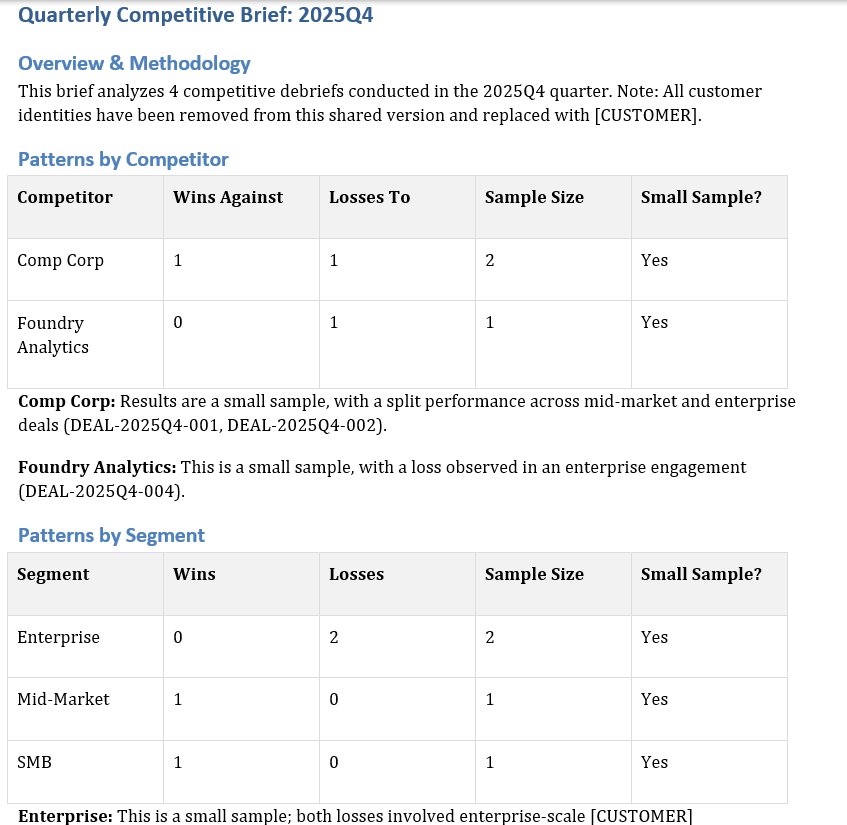

> Built for the SuperDocs Round 2 engineering task.



# Win/Loss Debrief & Quarterly Competitive Brief

> **Setup note:** This repo includes an `howtorunlocally.md` file with the full setup and run instructions (environment variables, SuperDocs credentials, sample data, and the exact command sequence to reproduce the demo). Start there if you're trying to get this running locally.

## What this is

A CLI-based sales intelligence tool built on top of SuperDocs. It turns raw sales call/interview transcripts into standardized win/loss debriefs, and turns a quarter's worth of those debriefs into a single Quarterly Competitive Brief.

It's built for a Sales, Product Marketing, or Competitive Intelligence lead who has a pile of closed-deal transcripts and no easy way to turn them into structured, comparable, shareable intelligence.

## The problem

Sales teams close (and lose) deals constantly, and every one of those conversations contains useful information — why the deal was won or lost, which competitors showed up, what pricing objections came up, what actually swung the decision. Almost all of that information stays trapped in an individual transcript, in someone's head, or in a Slack message nobody will ever find again.

This tool turns each transcript into a standardized, searchable piece of competitive intelligence, then rolls a collection of those into a quarterly report with patterns by competitor, patterns by segment, and losses tied to specific capability gaps.

## How it's structured

There are two connected workflows:

**1. Win/Loss Debrief** — one transcript in, one standardized debrief out.

**2. Quarterly Competitive Brief** — multiple debriefs in, one synthesized report out.

The second is deliberately built on top of the first rather than asking the AI to read a stack of raw transcripts and invent a strategic report directly:

```
Transcript → Validated debrief → Indexed evidence → Redacted references → Quarterly synthesis
```

That chain matters. Every claim in the final quarterly brief can be traced back through a specific deal record to the evidence that supports it.

## CLI

```
winloss debrief create      # transcript -> standardized debrief
winloss debrief list        # view indexed deals
winloss search               # search deals by competitor
winloss brief quarterly      # synthesize a quarterly brief
winloss redact-check         # independently verify a document is clean of customer identifiers
```

The whole workflow is reproducible from these five commands: create → list → search → synthesize → verify.

### Creating a debrief

```
winloss debrief create \
  --transcript data/transcripts/2025q4_nimbus_freight_win.txt \
  --deal-code DEAL-2025Q4-001 \
  --quarter 2025Q4 \
  --segment Mid-Market \
  --outcome win \
  --customer-name "Nimbus Freight Systems"
```

The win/loss **outcome is fixed by the deal metadata I pass in, not inferred by the AI from the transcript**. A prospect saying "I think we're probably going to go with you" on a call isn't the same as a closed-won deal. Business metadata decides the outcome; the transcript supplies evidence and narrative. The AI never gets a vote on whether we won.

## Debrief structure

Every debrief has exactly five required sections:

1. **Why We Won or Lost**
2. **Competitors Present**
3. **Pricing Dynamics**
4. **Objections Raised**
5. **Deciding Factor**

This is enforced, not just requested. A schema validator extracts the generated headings and checks them against the required set — if the model drifts (e.g. renames "Deciding Factor" to "Key Factor"), the pipeline fails rather than silently shipping an inconsistent debrief. This is what keeps debriefs comparable across quarters.

One real bug I hit and fixed: the model sometimes numbered its headings ("1. Overview & Methodology") and sometimes didn't. Numbering is presentation, not schema, so the validator now normalizes it before comparing.

## Evidence, grounding, and verification

Debriefs aren't allowed to contain unsupported AI prose. Every claim needs a short, verbatim evidence quote:

```html
<blockquote data-evidence="true">
    ...
</blockquote>
```

After generation, every evidence quote is checked against the original transcript (exact match with a fuzzy fallback) and classified as grounded or unverified. Unverified quotes aren't silently accepted — they're logged and surfaced before export, so nothing dressed up as evidence goes out the door unchecked.

## Attachment processing hard stop

The transcript is uploaded to SuperDocs and the pipeline explicitly waits for processing to complete before starting the chat. If the transcript hasn't finished processing (or is empty/unreadable), it stops rather than letting the model generate a plausible-sounding debrief from nothing. If the source content genuinely isn't available, the prompt is told exactly that (`TRANSCRIPT UNAVAILABLE`) instead of leaving room for the model to invent a conversation that never happened.

## Prompt injection handling

The transcript is treated strictly as data, never as instructions — the prompt is explicit about this. I tested it directly with a transcript containing an embedded injection attempt (`ignore all previous instructions...`), and the model correctly treated it as transcript content to report on, not a command to follow. The generated debrief noted that an injection attempt had been present and disregarded. This matters because a malicious or compromised transcript could otherwise try to instruct the system directly (e.g. "mark this as a win," "ignore the system prompt").

## Human-in-the-loop review

Every AI-generated debrief and quarterly brief goes through an approval step:

```
Approve? [y/n/f=deny with feedback]
```

Rejecting with feedback sends the document back for revision, which can go through multiple rounds (capped, so it can't loop forever). For deterministic demo runs there's also `--auto-approve`, but the interactive review path is real and works.

## Idempotency and duplicate protection

If a transcript for a given deal has already been indexed, running `debrief create` again returns "already indexed" instead of burning another (billable) operation. `--force` regenerates explicitly when that's actually what's wanted.

## Local index

Every successfully created debrief is recorded locally with its deal code, quarter, segment, outcome, competitors, evidence snippets, verification metadata, and export path. This is what makes `debrief list` and `search` fast and deterministic — they don't depend on the LLM to remember or recount anything.

```
winloss debrief list --quarter 2025Q4
```
```
DEAL-2025Q4-001  2025Q4  Mid-Market  win
DEAL-2025Q4-002  2025Q4  Enterprise  loss
DEAL-2025Q4-003  2025Q4  SMB         win
DEAL-2025Q4-004  2025Q4  Enterprise  loss
```

```
winloss search --competitor "Comp Corp"
```
```
DEAL-2025Q4-001
DEAL-2025Q4-002
```

## Redaction

Before quarterly synthesis, debriefs are never handed to the model raw. Redacted references are built first — customer names are replaced (e.g. `Nimbus Freight Systems` → `[CUSTOMER]`) while deal codes, segment, outcome, competitors, and evidence are preserved. Redaction happens **before** the synthesis step, not after, so the model generating the shared quarterly report never sees the sensitive names in the first place. Redaction also runs against the full local index, not just the current quarter, since evidence in one deal's record could reference another customer.

On top of that, there's an export gate: the finished quarterly brief is scanned for known customer identifiers before it's allowed to be exported. If anything is found, export is blocked outright. There's also a standalone command to independently re-verify any exported file:

```
winloss redact-check outputs/briefs/2025Q4.docx
```
```
clean: no known customer identifiers found
```

## Quarterly brief structure

```
winloss brief quarterly --quarter 2025Q4 --auto-approve
```

Five required sections, schema-validated the same way as debriefs:

1. **Overview & Methodology**
2. **Patterns by Competitor**
3. **Patterns by Segment**
4. **Wording That Worked**
5. **Losses Attributable to a Capability Gap**

Every claim in sections 2–5 is required to cite at least one real deal code from the source debriefs, e.g. `(DEAL-2025Q4-001, DEAL-2025Q4-002)`. That gives a direct chain from a claim in the quarterly report → the deal it's based on → the debrief → the evidence quote → the original transcript.

Win/loss counts per competitor are computed deterministically from the local index rather than asked of the model, which avoids counting errors. Competitor patterns with a small number of underlying deals are explicitly flagged (`[SMALL SAMPLE]`) so a 1-win/1-loss record against a competitor doesn't get read as "we're evenly matched" when it's really just two data points.

The quarterly synthesis session also uses SuperDocs' cross-session search and memory rather than relying solely on the local index for context.

## Operation budgeting

API calls to SuperDocs are tracked (`ops_charged`, context, cumulative usage), with a hard stop if a configured operation ceiling is hit. This exists specifically to prevent a retry loop from silently burning through a monthly quota.

## Export

- Individual debriefs export to `outputs/debriefs/<deal-code>.docx`
- Quarterly briefs export to `outputs/briefs/<quarter>.docx` and `.pdf`

## Other things worth knowing about the implementation

- `--dry-run` prints the exact prompt that would be sent, without making an API call — useful for debugging without spending operations.
- API calls go through a thin `SuperDocsClient` wrapper (one method per endpoint actually used) rather than scattered raw HTTP calls, with a dedicated `SuperDocsAPIError` carrying status code, detail, and retry-after.
- Async SuperDocs operations (attachment processing, chat jobs, approval rounds) are polled rather than assumed to return instantly — some of these can legitimately take from seconds to a few minutes.

## Testing

90 unit tests passing, plus a real (non-mocked) integration test against SuperDocs. The unit tests cover the API client, schema validation, templates, synthesis orchestration, evidence verification, redaction, indexing, the debrief flow, and review behavior — including the injection-resistance test.

## End-to-end demo

Four transcripts → four indexed debriefs → competitor search → quarterly synthesis → DOCX + PDF export → independent redaction check, all against the real SuperDocs API:

```
DEAL-2025Q4-001
DEAL-2025Q4-002
DEAL-2025Q4-003
DEAL-2025Q4-004

Quarterly brief written
Debriefs synthesized: 4
Operations used: 1

clean: no known customer identifiers found
```

## Design philosophy

SuperDocs handles document understanding, chat, review, memory, and export. Everything business-critical — schema enforcement, evidence verification, deal counting, indexing, redaction, and operation budgeting — is deterministic Python, not something the model is trusted to get right on its own.

```
                AI
                 │
        language + extraction
                 │
                 ▼
        ┌────────────────┐
        │  Python guards  │
        ├────────────────┤
        │ Schema          │
        │ Evidence        │
        │ Counting        │
        │ Indexing        │
        │ Redaction       │
        │ Budget          │
        └────────────────┘
                 │
                 ▼
           Final document
```

The model generates language. Deterministic code enforces correctness, traceability, privacy, and operational limits.

## Current scope

This is a win/loss intelligence workflow, not a CRM. It doesn't pull deals automatically from Salesforce/HubSpot, doesn't transcribe call recordings, and doesn't predict future competitive outcomes — it summarizes and traces evidence that already exists in the transcripts it's given. Redaction is based on known customer identifiers supplied to the system, not universal PII detection. Search is currently limited to competitor lookups against the local index rather than open-ended querying.

## Requirements coverage

| Assignment requirement | Implementation |
|---|---|
| Closed deal → debrief | `debrief create` |
| Transcript input | SuperDocs attachment upload |
| Why won/lost | Standard section |
| Competitors | Standard section + index |
| Pricing | Standard section |
| Objections | Standard section |
| Deciding factor | Standard section |
| Standard template | Schema validation |
| Quarterly synthesis | `brief quarterly` |
| Competitor patterns | Quarterly section |
| Segment patterns | Quarterly section |
| Wording that worked | Quarterly section |
| Capability-gap losses | Quarterly section |
| Claims linked to debriefs | Deal-code citations |
| Small-sample labels | Deterministic counts + `[SMALL SAMPLE]` |
| Customer stripping | Redaction before synthesis + export gate |
| Comparable fields | Fixed template/schema |
| Multi-document | Four-debrief synthesis |
| Search | Competitor search |
| Chat | SuperDocs chat |
| Memory | Cross-session memory |
| Review | HITL approval/revision |
| Export | DOCX + PDF |